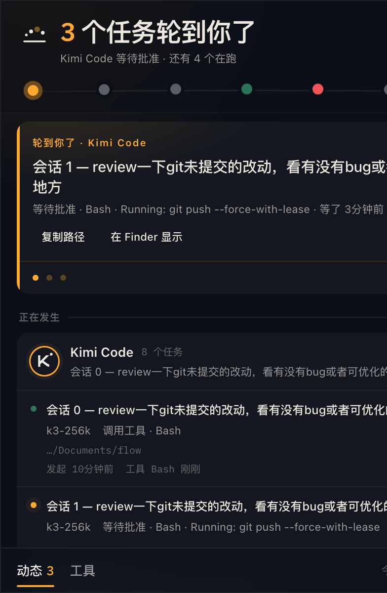

# Murmur

菜单栏 AI Agent 状态伴侣 · A menu-bar status companion for AI coding agents




**纯观察者**：只读本地数据、无遥测、退出即全停。质感来自克制——只做状态呈现，不碰你的数据，不增功能噪音。

## 这是什么

你同时开着几个 AI 编码 agent（Kimi、Codex、Cursor……），它们各自跑在终端或 IDE 里——谁在干活、谁卡住等你批准、谁的额度快见底，没有统一答案。Murmur 栖在 macOS 菜单栏，把它们聚成一眼可读的动态：托盘标题实时聚合 `◆n`（有会话等你）/ `●n`（有会话在跑），点开是面板两视图——「动态」（waiting 置顶 hero + 正在发生 + 最近结束）与「工具」（逐 agent 接入实况、额度窗口）；底栏另开**管理台**窗口：接入诊断、用量、会话文件、设置。

## 安装

从 [Releases](https://github.com/chen-wang-jun/murmur/releases) 下载 `macos-arm64-Murmur.dmg`（仅 Apple Silicon），拖进 `/Applications`。

未做 Apple 签名/公证——首次打开会被 Gatekeeper 拦：右键 App →「打开」放行一次即可（或 `xattr -d com.apple.quarantine /Applications/Murmur.app`）。

## 支持的 Agent

| 工具 | 状态采集 | 额度 | 备注 |
|---|---|---|---|
| Kimi Code | hook 上报 + wire.jsonl | `/usages` 官方端点 | |
| ZCode | hooks.events + sqlite/jsonl 轮询 | BYOK（z.ai / bigmodel） | 本机凭据加密，需自填 Key |
| OpenCode | 插件上报 + opencode.db 轮询 | 本地台账 | |
| Codex | hooks.json + notify + rollout tail | app-server RPC | 非 managed hook 需 `/hooks` trust |
| Cursor | hooks.json + transcripts tail | usage-summary | CLI 只发部分生命周期事件 |
| Devin | config.json hooks + sessions.db | Connect RPC + BYOK `cog_` | 云端会话走 v3 API |
| Qoder | settings.json hooks + jsonl + main.sqlite | 暂缺（PAT 候选） | 桌面端与 CLI 共用 `~/.qoder` |
| MiniMax Code | runtime-state.sqlite 只读轮询 | 暂缺 | 纯 pull，官方未开放 hooks；IDE/CLI 共用 `~/.minimax` |
| oh-my-pi (omp) | TS 扩展上报 + sessions journal tail | agent.db `usage_history` 本地快照 | 扩展模块非 shell hook，落 `~/.omp/agent/extensions/` |
| Claude Code | settings.json hooks + projects/ jsonl | `/api/oauth/usage`（Keychain/.credentials.json 只读） | 凭据不代刷；终端/IDE/桌面宿主共用 `~/.claude` |

## 功能

- **实时状态**：working / waiting（轮到你了）/ stale / idle，三平面采集——push hook、pull watcher、官方额度端点互为冗余；状态再细分——working 分 thinking/tool 相位（带当前工具名），waiting 分 approval/question/turn-end（带等待对象），会话行下挂「发起/工具/等待中」轻量时间线
- **接入诊断**：管理台逐 agent 三平面探针（数据面/hook 活性/pull 游标）+「测试链路」marker 全真自检 + 首启一键接入引导
- **用量台账**：本地 `bun:sqlite` 日聚合（token + 估算成本），额度快照 10 分钟一轮；管理台用量页——自然年热力图 + 按工具堆积柱 + 按模型折线 + 自定义区间
- **BYOK**：本地凭据不可读的 agent（如 zcode）支持自填 API Key，存 `~/.murmur/credentials.json`（0600），对外只显示掩码
- **会话文件管理**（管理台 tab）：盘点各 CLI 的磁盘会话产物，按工具/项目过滤、批量清理——文件进废纸篓可恢复，库内行事务删除
- **外观**：「暮色栖木」墨蓝黑底 + 琥珀天光，IBM Plex Mono 数据字体；跟随系统/暗/亮主题，自定义字体
- **应用内更新**：启动静默检查 + 设置页手动检查，「更新并重启」一键换包（直取 GitHub Releases，dev 构建不触网）
- **两级开关**：监听总闸 + hook 上报独立开关，卸载 hook 只摘除自己的条目，不碰共存工具的注入

## 隐私与安全

- 所有数据只进 `~/.murmur/`（sqlite 台账 + 设置 + spool），无任何遥测与上报
- hook 脚本只向 `127.0.0.1` 随机端口的本机 ingest 服务 POST，token 鉴权，任何分支 `exit 0` 不干预 agent 决策链
- 各 agent 的凭据严格只读，绝不代刷；BYOK key 明文不出 `credentials.json`

## 技术栈

Electrobun 桌面壳（Bun 主进程 + 系统 webview，无 Node/CEF）· React 19 + shadcn/ui + Zustand + Tailwind CSS v4 · `packages/core` 纯 TS 引擎（零运行时依赖，`bun test` 可独立跑）

## 构建与开发

前置：macOS、[Bun](https://bun.sh)、`hutch` 工具链（`~/.hutch/bin` 在 PATH 中，见 `apps/desktop/hutch.config.ts`）。

```bash
cd apps/desktop && hutch install && hutch electrobun sync  # 首次

bun run dev            # 构建并启动（watch 模式）
bun run dev:hmr        # vite HMR 开发模式
bun run build          # 出稳定 .app 包
bun run test           # core 引擎测试
bun run typecheck      # core 类型检查
bun run typecheck:desktop  # 桌面端类型检查
```

## 贡献与反馈

欢迎 issue 与 PR。开发约定见 [CONTRIBUTING.md](CONTRIBUTING.md)，架构与禁区见 [AGENTS.md](AGENTS.md)。

## License

[MIT](LICENSE) © wangjun ([@chen-wang-jun](https://github.com/chen-wang-jun))

---

# Murmur (English)

A menu-bar status companion for AI coding agents — **a pure observer**: reads only local data, zero telemetry, everything stops on quit.


## What it does

AI coding agents each live in their own terminal or IDE — which one is working, which is blocked waiting for your approval, which is about to hit a quota wall? Murmur sits in the macOS menu bar and answers at a glance: the tray title aggregates `◆n` (sessions waiting on you) / `●n` (sessions working), and a click opens a two-view panel — **Live** (waiting hero + active + recently ended) and **Agents** (per-agent status and quota windows). A separate **Manager window** holds diagnostics, usage, session files, and settings.

## Install

Download `macos-arm64-Murmur.dmg` from [Releases](https://github.com/chen-wang-jun/murmur/releases) (Apple Silicon only) and drag it into `/Applications`.

The app is unsigned — Gatekeeper blocks the first launch: right-click the app → "Open" once (or `xattr -d com.apple.quarantine /Applications/Murmur.app`).

## Agents

Supports **10 agents** — Kimi Code, ZCode, OpenCode, Codex, Cursor, Devin, Qoder, MiniMax Code, oh-my-pi, Claude Code — via a three-plane collection model: push hooks, pull watchers, and official quota endpoints, normalized into one status machine.

## Features

- Real-time session states (working / waiting / stale / idle), subdivided — working shows thinking/tool phase, waiting shows approval/question/turn-end with what's being waited on, plus a per-session mini timeline
- Onboarding diagnostics: per-agent three-plane probes, a marker end-to-end self-test, and first-run one-click setup
- Local usage ledger (`bun:sqlite` daily aggregates) + quota snapshots; usage page with a calendar-year heatmap, per-tool bars, per-model lines, and custom ranges
- BYOK API keys for agents whose local credentials are encrypted (`~/.murmur/credentials.json`, mode 0600, masked in UI)
- Session file manager (Manager tab): inventory, filter, and batch-clean CLI session artifacts (files → Trash, DB rows → transactional delete)
- "Dusk Perch" design — ink-dark surfaces + amber light, IBM Plex Mono data font; dark/light/system theme and custom font
- In-app updates: silent check at launch + manual check in settings; "Update & restart" swaps the bundle straight from GitHub Releases (dev builds never hit the network)
- Two-level switches: observe gate + hook reporting toggle; hook uninstall only removes Murmur's own entries

## Privacy

Everything stays in `~/.murmur/` — no telemetry, no outbound reporting. Hook scripts only POST to a localhost ingest server with token auth. Agent credentials are strictly read-only; BYOK keys never leave `credentials.json` in plaintext.

## Development

Requires macOS, [Bun](https://bun.sh), and the `hutch` toolchain on PATH (see `apps/desktop/hutch.config.ts`).

```bash
bun run dev        # build & run (watch)
bun run dev:hmr    # vite HMR mode
bun run build      # stable .app bundle
bun run test       # core engine tests
```

Stack: Electrobun (Bun main process + system webview) · React 19 + shadcn/ui + Zustand + Tailwind CSS v4 · `packages/core` pure-TS engine.

See [CONTRIBUTING.md](CONTRIBUTING.md) and [AGENTS.md](AGENTS.md).

## License

[MIT](LICENSE) © wangjun ([@chen-wang-jun](https://github.com/chen-wang-jun))
